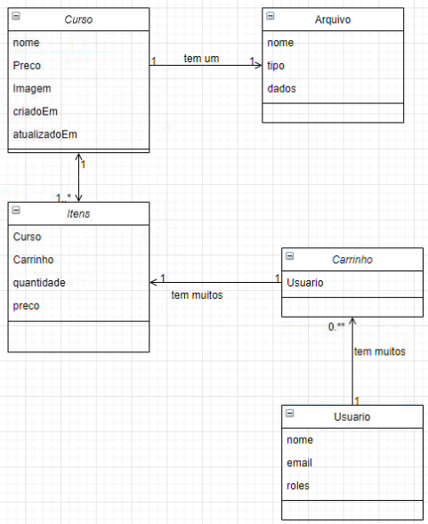

<h1 align="center">
    
</h1>
<h2 align="center">🚧 Em Desenvolvimento 🚧</h2>
<h3 align="center">Início : 19/10/2020 - Término : 23/10/2020 - Desenvolvimento do BackEnd em Java com Spring</h3>
<h3 align="center">Início : 26/10/2020 - Término : 30/10/2020 - Desenvolvimento do FrontEnd com Vue.js</h3>
<h1 align="center">Bootcamp Java Spring Boot + Vue.js</h1>

<p align="center">
  

 

  <a href="https://github.com/tgmarinho/nlw1/commits/master">
    
  </a>

</p>

## 💻 Sobre o projeto

O Projeto desenvolvido é de uma plataforma básica de venda de cursos com autenticação.

### Diagrama do Projeto

<h2 align="center">
    
</h2>

### Telas do Projeto

## 🛠 Tecnologias

As seguintes ferramentas foram usadas na construção do projeto:

- [Java 11](https://www.oracle.com/java/technologies/javase-jdk11-downloads.html)
- [Spring Boot](https://spring.io/projects/spring-boot)
- [JPA](https://spring.io/projects/spring-data-jpa)
- [JWT](https://jwt.io/)
- [Oauth 2](https://oauth.net/2/)
- REST API
- [Vue.Js](https://vuejs.org/)

## 🚀 Como executar o projeto

Podemos considerar este projeto como sendo divido em duas partes:

1. Back End (pasta backend)
2. Front End (pasta frontend)

💡 O Front End precisa que o Back End esteja sendo executado para funcionar.

### Pré-requisitos

Antes de começar, você vai precisar ter instalado em sua máquina as seguintes ferramentas:
[Git](https://git-scm.com), [Java 11]().
Além disto é bom ter um editor para trabalhar com o código como [VSCode]()

### 🎲 Rodando o Back End (servidor)

```bash
# Clone este repositório
$ git clone https://github.com/brunoemferreira/UNICIV-Winter-Camp-Spring-Vue.git

# O servidor inciará na porta:8080
```

### 🧭 Rodando a aplicação web (Front End)

```bash
# Clone este repositório
$ git clone https://github.com/brunoemferreira/UNICIV-Winter-Camp-Spring-Vue.git

```
